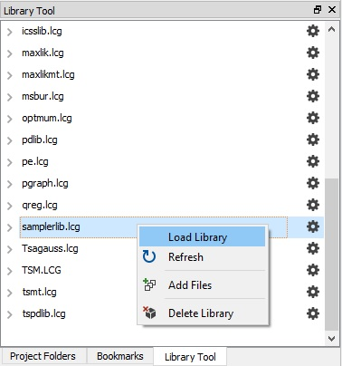

# gauss-sampler-library

## What is GAUSS?
**GAUSS** is an easy-to-use data analysis, mathematical and statistical environment based on the powerful, fast and efficient **GAUSS Matrix Programming Language**. **GAUSS** is a complete analysis environment with the built-in tools you need for estimation, forecasting, simulation, visualization and more.

## What is the GAUSS sampler library?
The [**GAUSS**](www.aptech.com) sampler library is a collection of [**GAUSS**](www.aptech.com) procedures and examples developed to implement :
* An example importance sampler
* An example Gibbs sampler
* An example Random Walk and Independent Chain Metropolis-Hastings sampler

## Getting Started
### Prerequisites
The program files require a working copy of [**GAUSS 19**](www.aptech.com). Many can be run on earlier versions with some small revisions.

### Installing
The GAUSS sampler library can be easily installed using the [**GAUSS Application Installer**](https://www.aptech.com/support/installation/using-the-applications-installer-wizard/), as shown below:

1. Download the zipped folder `samplerlib.zip` from the [GitHub Sampler Release](https://github.com/aptech/gauss-sampler-library/releases) page.
2. Select **Tools > Install Application** from the main **GAUSS** menu.  
  

3. Follow the installer prompts, making sure to navigate to the downloaded `samplerlib.zip`.
4. Before using the functions created by `samplerlib` you will need to load the newly created `samplerlib` library. This can be done in a number of ways:
  *   Navigate to the **Library Tool Window** and click the small wrench located next to the `samplerlib` library. Select `Load Library`.  
  
  *  Enter `library samplerlib` in the **Program Input/output Window**.
  *  Put the line `library samplerlib;` at the beginning of your program files.

>  Note: I have provided the individual files found in [`samplerlib.zip`](https://github.com/aptech/gauss-sampler-library/releases) for examination and review. However, installation should always be done using the [`samplerlib.zip` folder from the release page](https://github.com/aptech/gauss-sampler-library/releases) and the [**GAUSS Application Installer**](https://www.aptech.com/support/installation/using-the-applications-installer-wizard/).

## Authors
[Erica Clower](mailto:eclower@aptech.com)  
[Aptech Systems, Inc](https://www.aptech.com/)  
[![alt text][1.1]][1]
[![alt text][2.1]][2]
[![alt text][3.1]][3]

<!-- links to social media icons -->
[1.1]: https://www.aptech.com/wp-content/uploads/2019/02/fb.png (Visit Aptech Facebook)
[2.1]: https://www.aptech.com/wp-content/uploads/2019/02/gh.png (Aptech Github)
[3.1]: https://www.aptech.com/wp-content/uploads/2019/02/li.png (Find us on LinkedIn)

<!-- links to your social media accounts -->
[1]: https://www.facebook.com/GAUSSAptech/
[2]: https://github.com/aptech
[3]: https://linkedin.com/in/ericaclower
<!-- Please don't remove this: Grab your social icons from https://github.com/carlsednaoui/gitsocial -->
